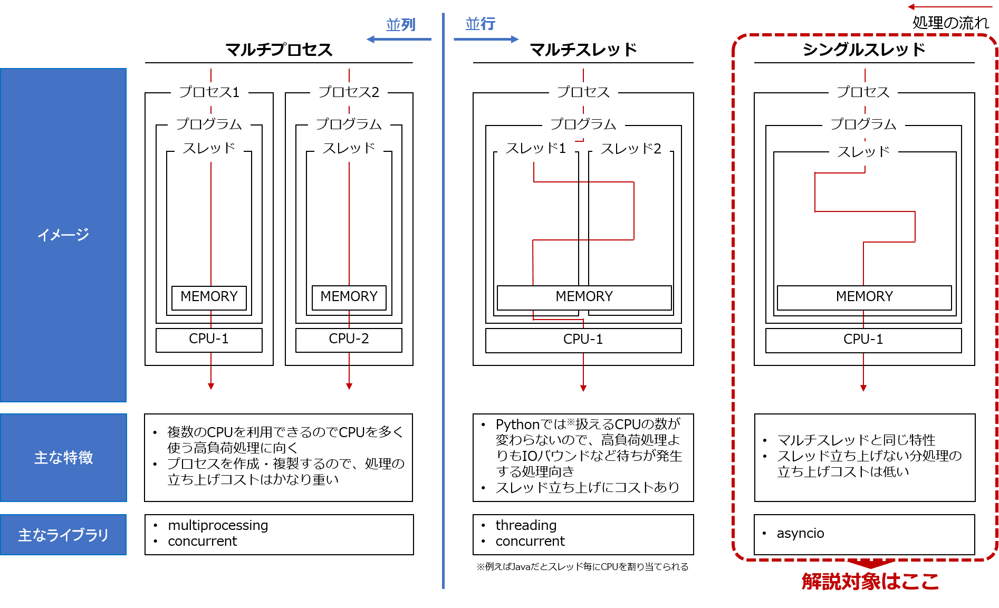
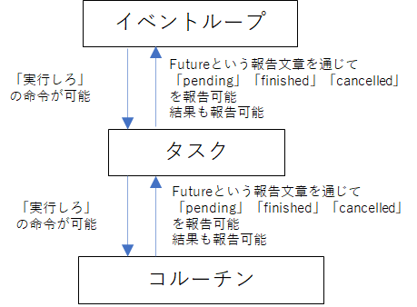
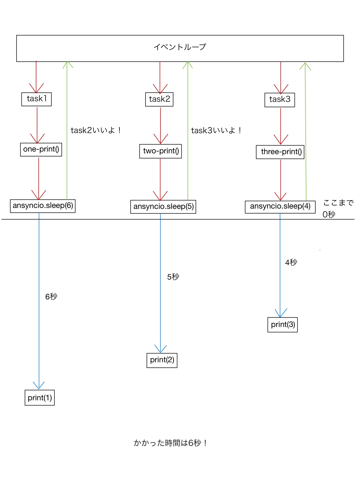

# asyncio入門！！！

## asyncioとは？
asyncioとは __シングルスレッドで非同期・並行処理__ を行うための標準ライブラリです。読み方は~~「エイシンシオ」~~「エイシンクアイオー」らしい。

### シングルスレッド
シングルスレッドとマルチスレッド、マルチプロセスの違いは以下の通りです。



### 非同期処理
複数タスクを実行する際に、あるタスクが動いていても「処理を止めずに別のタスクを実行」できる方式のこと

__同期処理__ ：複数タスク(スレッド)を実行する際に1個ずつ「順番に」実行される方式のこと

### 並行処理
処理AとBを切り替えながら処理すること

__逐次処理__ ：1つずつ順番に処理する方法。処理Aが完全に終わったら処理Bを処理すること

__並列処理__ ：処理AとBを同時並列で処理すること

## 実装例を見てみよう！
```python
import asyncio
import time

async def one_print(): #6秒後に1をprint
    await asyncio.sleep(6)
    print(1)

async def two_print(): #5秒後に2をprint
    await asyncio.sleep(5)
    print(2)

async def three_print(): #4秒後に3をprint
    await asyncio.sleep(4)
    print(3)

async def main():
    start = time.time() #開始時間
    task1 = asyncio.create_task(one_print())
    task2 = asyncio.create_task(two_print())
    task3 = asyncio.create_task(three_print())
    await task1
    await task2
    await task3
    end = time.time() #終了時間
    print(f"かかった時間：{end-start}")

asyncio.run(main()) #実行
```
```python
3
2
1
かかった時間：6.00412392616272
```
ここで普通に実行したもの（逐次処理）と比較してみましょう。
```python
def one_print(): #6秒後に1をprint
    time.sleep(6)
    print(1)

def two_print(): #5秒後に2をprint
    time.sleep(5)
    print(2)

def three_print(): #4秒後に3をprint
    time.sleep(4)
    print(3)

start = time.time() #開始時間
one_print()
two_print()
three_print()
end = time.time() #終了時間
print(f"かかった時間：{end-start}")
```
```python
1
2
3
かかった時間：15.011961936950684
```
出力される数字の順番が違いますね。かかった時間も短くなっています！

## 具体的な解説
asyncioを使ったコードの解説をしていきます。
まずこの部分を見ていきましょう。
```python
async def one_print(): #6秒後に1をprint
    await asyncio.sleep(6)
    print(1)
```
このような`def`の前に`async`をつけて関数定義したものを　__「コルーチン」__ といいます。

サブルーチン（普通に関数定義したやつ）はエントリーからリターンまでをひとつの処理単位とするのに対し、コルーチンは一旦処理を中断した後、続きから処理を再開できます。

そのあとの`await`で、コルーチンの中で中断、再開する処理を指定します。（後でもう少し詳しく説明します。）

ここで、
```python
async def print_four():
    await asyncio.sleep(1)
    print(4)
    return

print_four()
```
のように通常通りに関数呼び出しをしても以下のようにエラーが出て実行できません。
```
RuntimeWarning: coroutine 'print_four' was never awaited
  print_four()
RuntimeWarning: Enable tracemalloc to get the object allocation traceback
```
（`<function f at 0×0000025479C403A0>`のようにコルーチンオブジェクトとして値が帰ってくると書いてある記事もありますが僕はそうなりませんでした・・・。）

コルーチンを実行するには実行機構である __イベントループ__ が必要です。

__イベントループ__ とは、「何かしらリクエストがあった時に、登録された順番に従って処理を進め、次のリクエストを待つループを繰り返す」的なものです。　

基本的に以下のように`asyncio.run()`を用いて実行します。
```python
asyncio.run(print_four())
```
```
4
```
次に、`one_print()`、`two_print()`、`three_print()`を定義した後の関数を見ていきましょう。
```python
async def main():
    start = time.time() #開始時間
    task1 = asyncio.create_task(one_print())
    task2 = asyncio.create_task(two_print())
    task3 = asyncio.create_task(three_print())
    await task1
    await task2
    await task3
    end = time.time() #終了時間
    print(f"かかった時間：{end-start}")
```
これは`one_print()`、`two_print()`、`three_print()`を実行していくためのコルーチンです。ここで登場するのが __タスク__ です。

__タスク__ とはコルーチンをReady状態にし、実行状態と結果を管理するもので、`asyncio.create_task(coroutine())` で作成します。Ready状態にするだけなので、タスクを作っただけではコルーチンは実行されません。どこかのコルーチンが一時停止状態になって、計算リソースが解放されて初めて処理が実行されます。おおよそReady状態になった順番にリソースが割り当てられるらしいです。

タスクがないと以下のようになってしまいます。
```python
async def one_print():
    await asyncio.sleep(6)
    print(1)

async def two_print():
    await asyncio.sleep(5)
    print(2)

async def three_print():
    await asyncio.sleep(4)
    print(3)

async def main():
    start = time.time()
    await one_print()
    await two_print()
    await three_print()
    end = time.time()
    print(f"かかった時間：{end-start}")

asyncio.run(main())
```
```python
1
2
3
かかった時間：15.007637977600098
```
このように並行処理されず処理時間が15秒かかっています。

__並行化したいものはとりあえずタスクを作成し、それをawaitしよう！__

最後の行を見ていきます。
```python
asyncio.run(main())
```
これによって
1. 新しくイベントループを作成
2. 指定されたコルーチンオブジェクトをイベントループに登録し、タスクオブジェクトを作成
3. タスクオブジェクトが完了するまでイベントループを実行し続ける

という処理を行なっているみたいです。
```python
if __name__ == "__main__":
    loop = asyncio.get_event_loop()
    loop.run_until_complete(run())
```
KINGFISHERの実行のコードはこのようになっています。`asyncio.get_event_loop`でイベントループを作成して、`loop.run_until_complete`でタスクが終了するまでイベントループを実行しています。

python3.7から`asyncio.run()`だけで実行されるようになったのでこっちを使ったほうが便利かな？

## awaitについてもう少し詳しく
awaitはawaitの対象となる __Awaitableオブジェクト__ の実行結果が返ってくるまでawaitが宣言された実行中のコルーチンを一時停止させ、計算リソースを手放す式です。開いた計算リソースはイベントループが管理している、（タスクによって）Ready状態になったコルーチンに割り当てられます。

awaitは実行中のコルーチンを一時停止させる式なので、コルーチンの中でしか宣言できません。また式なので実行結果を`=`で変数に代入することができます。

__Awaitableオブジェクト__ にはコルーチン、タスク、__Future__ の3つがあります。

__Future__ とは処理の結果を格納するためのオブジェクトです。「結果」と「ステータス」という属性があります。
ステータスには初期状態の"__pending__"、終了状態の"__finished__"（結果が格納）と”__cancelled__"の3種類があります。

相関図は次の通りです。



実際にawaitにFutureを直接使うことは基本的にありません。（Futureはタスクの低レベルAPIだからだそう。）

__「コルーチンやタスクを実行させる行では、書式Futureのやりとりが必要になるため、そのような行ではawaitを先頭につけるという決まりになっている」__

という説明がわかりやすいと思います。

## プログラムのイメージ
全体のイメージは下のようになると思います。緑の矢印はFutureを通じて「pending」を報告している様子です。実際は前の図のようにタスクを介していて、別で「finished」も報告されていると思います。



## gather
多くのタスクを扱う場合は`asyncio.gather()`を用いると`main()`の部分を次のように短く書き換えることができます。
```python
async def main():
    start = time.time() #開始時間
    await asyncio.gather(
        one_print(),
        two_print(),
        three_print()
    )
    end = time.time() #終了時間
    print(f"かかった時間：{end-start}")
```
## ensure_future
`ensyre_future`でもタスクを作ることができるが、`create_task`の利用が推奨されています。違いは以下の通りです。（`create_task`の方がより具体的みたいだけどよくわかりません…。）
### `create_task`
- コルーチンを受け入れる。
- タスクを返す。
- ループのコンテキストで呼び出される。
### `ensure_future`
- Future、コルーチン、awaitableオブジェクトを受け入れます。
- タスク (Future が渡された場合は Future) を返します。
- 指定された引数がコルーチンの場合`create_task`を使用。
- ループオブジェクトを渡すことができる。
### 実装例
```python
async def one_print(): #6秒後に1をprint
    await asyncio.sleep(6)
    print(1)

async def two_print(): #5秒後に2をprint
    await asyncio.sleep(5)
    print(2)

async def three_print(): #4秒後に3をprint
    await asyncio.sleep(4)
    print(3)

async def main():
    start = time.time() #開始時間
    task1 = asyncio.ensure_future(one_print())
    task2 = asyncio.ensure_future(two_print())
    task3 = asyncio.ensure_future(three_print())
    await task1
    await task2
    await task3
    end = time.time() #終了時間
    print(f"かかった時間：{end-start}")

if __name__ == "__main__":
    loop = asyncio.get_event_loop()
    loop.run_until_complete(main()) #実行
```
```python
3
2
1
かかった時間：6.0050060749053955
```
KFのコードには
```python
await task1
await task2
await task3
```
に当たる部分がなく、タスクが実行されていないのでは…。
## 最後に
ネットの記事のパクリばっかりですみません！URL載せておきます。

https://qiita.com/ku_a_i/items/129543dd7a05342d132f

https://qiita.com/haryuu/items/b948c2953d4c4493ba7a

https://qiita.com/shota-s123/items/36e365d99c7413f60826

https://note.crohaco.net/2019/python-asyncio/

https://stackoverflow.com/questions/36342899/asyncio-ensure-future-vs-baseeventloop-create-task-vs-simple-coroutine
